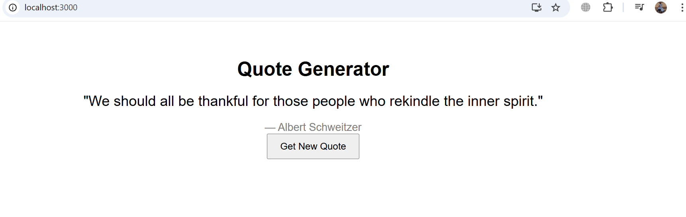

## Features

- **Random Quotes**: Generates a new quote each time you click the button.
- **Category Selection**: Choose quotes based on different categories (e.g., motivation, love, success).
- **Copy to Clipboard**: Easily copy quotes to use elsewhere.
- **Share Feature**: Share quotes on social media platforms.
- **Minimalist UI**: Clean and simple user interface.

## Technologies Used

- Frontend: HTML, CSS, JavaScript

## Installation

1. Clone the repository:
   ```bash
   git clone https://github.com/GIZE21/quotes-generator.git
   ```
2. Navigate to the project directory:
   ```bash
   cd quotes-generator
   ```
3. Open `index.html` in your browser or start a local server.

## Usage

1. Open the quote generator in a browser.
2. Click the "Generate Quote" button to get a new quote.
3. Select a category (if applicable) for specific types of quotes.
4. Click "Copy" to copy the quote to your clipboard.
5. Click "Share" to share the quote on social media.
